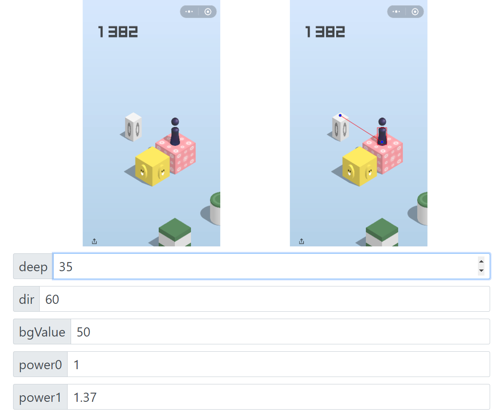

# 带有操作界面的微信跳一跳模拟器(NodeJS版)

## 使用说明
- 安装Node.JS [下载地址 https://nodejs.org/dist/v9.3.0/node-v9.3.0-x64.msi](https://nodejs.org/dist/v9.3.0/node-v9.3.0-x64.msi)
- `git clone git@github.com:yuanliwei/WXJump_node.git`
- `cd WXJump_node`
- USB连接手机打开调试选项
- 运行于浏览器中，自带Server不需要安装其它依赖(注:请使用chrome)
- `node ./app.js`
- 打开微信里的跳一跳
- 自己依个人手机具体状况调整各项参数 (参数可以使用鼠标滚轮或上下箭头调整)
- 然后让它自己跳吧
